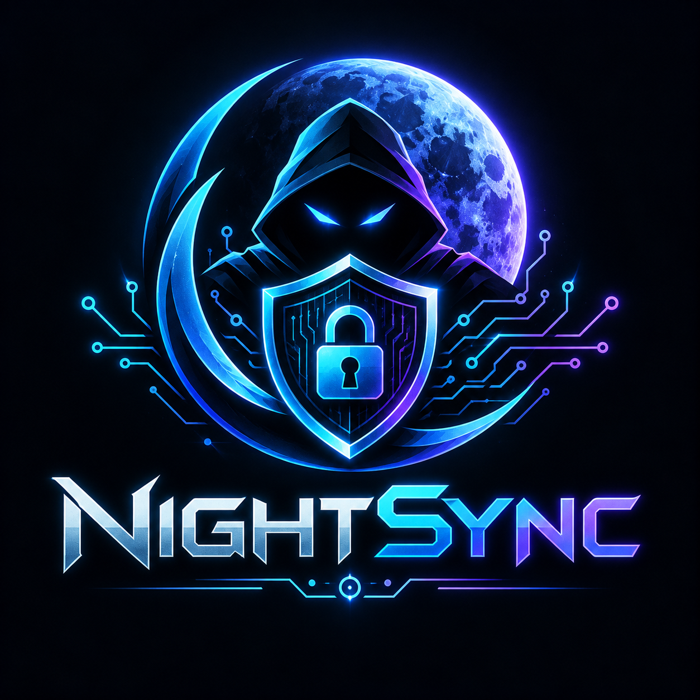
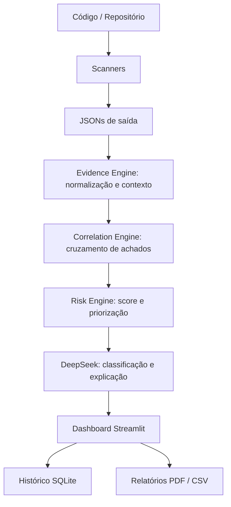

<div align="center">



# NIGHTSYNC

### ASPM — Application Security Posture Management

Plataforma acadêmica para centralizar, priorizar e correlacionar achados de segurança de múltiplas ferramentas em uma visão executiva unificada.

[](LICENSE.md)

</div>

---

## Sumário

- [Visão Geral](#visão-geral)
- [MVP](#mvp)
- [Principais Funcionalidades](#principais-funcionalidades)
- [Arquitetura](#arquitetura)
- [Ferramentas Integradas](#ferramentas-integradas)
- [Instalação do Zero](#instalação-do-zero)
- [Configuração do DeepSeek](#configuração-do-deepseek)
- [Executar o MVP em Modo Demonstração](#executar-o-mvp-em-modo-demonstração)
- [Executar o Dashboard](#executar-o-dashboard)
- [Executar uma Análise Real](#executar-uma-análise-real)
- [Ferramentas em Detalhe](#ferramentas-em-detalhe)
- [Gitleaks](#gitleaks)
- [GitHub Actions](#github-actions)
- [Risk Engine, Evidence Engine e Correlação](#risk-engine-evidence-engine-e-correlação)
- [Falsos Positivos e Análise Contextual](#falsos-positivos-e-análise-contextual)
- [OWASP e CVSS](#owasp-e-cvss)
- [URL Analysis e Attack Surface](#url-analysis-e-attack-surface)
- [CI/CD e Templates](#cicd-e-templates)
- [Testes Ofensivos (Laboratório Autorizado)](#testes-ofensivos-laboratório-autorizado)
- [Estudos, Validações e Evolução Técnica](#estudos-validações-e-evolução-técnica)
- [Estudo de Caso DefectDojo](#estudo-de-caso-defectdojo)
- [Testes e Validação](#testes-e-validação)
- [Troubleshooting](#troubleshooting)
- [Quick Start](#quick-start)
- [Interface do MVP](#interface-do-mvp)
- [Identidade Visual e Assets](#identidade-visual-e-assets)
- [Higiene do Repositório](#higiene-do-repositório)
- [Limitações e Roadmap](#limitações-e-roadmap)
- [Licença](#licença)

---

## Visão Geral

ASPM (Application Security Posture Management) é a prática de consolidar a postura de segurança de aplicações em um só lugar. Em vez de receber relatórios isolados de várias ferramentas, uma plataforma ASPM normaliza os achados, cruza evidências e entrega uma priorização executiva contínua.

O problema que este projeto resolve:

- Ferramentas de segurança (SAST, SCA, segredos, análise de URL) produzem relatórios em formatos distintos e sem correlação entre si.
- A priorização manual não escala e costuma tratar toda contagem de alerta como risco.
- Não existe uma visão executiva consolidada para gestores e times de segurança.

O que a plataforma entrega:

- **Pipeline automatizado** — um único comando executa múltiplos scanners e consolida o resultado.
- **Correlação de riscos** — cruza achados entre ferramentas (ex.: segredo vazado junto a endpoint exposto eleva a prioridade).
- **IA decisória** — classifica cada achado entre Vulnerabilidade, Hardening, Controle OK ou Falso Positivo.
- **Dashboard executivo** — visão consolidada para decisão, com histórico e relatórios.

O diferencial técnico está em três camadas construídas sobre as ferramentas: o **Evidence Engine** (normalização), o **Correlation Engine** (cruzamento) e o **Risk Engine** (score e priorização), detalhados mais adiante.

> Projeto acadêmico que usa como referência os frameworks **OWASP SAMM**, **OWASP Top 10:2025** e **OWASP SCVS**. Não se trata de uma certificação OWASP.

---

## MVP

O escopo desta entrega é um MVP funcional e reprodutível. A separação abaixo deixa claro o que está ativo, o que está preparado mas desativado, e o que é evolução futura.

### Implementado

- Autenticação com SQLite e senhas com hash bcrypt; perfis Administrador, Analista e Visualizador.
- Dashboard Streamlit com abas por fonte e visão executiva.
- Pipeline orquestrado: Semgrep, Bandit, pip-audit, Gitleaks e Trivy.
- Risk Engine, Evidence Engine e Correlation Engine.
- IA DeepSeek com fallback local (sem chave e offline).
- URL Analysis passiva (headers, HTTPS/TLS, WAF/CDN, cookies, JWT, subdomínios, crawler limitado).
- Attack Surface baseada em evidências.
- Mapeamento OWASP Top 10:2025, calculadora CVSS v3.1 e inventário de dependências (SBOM-lite).
- Análise estática de GitHub Actions e de templates (XSS) na aba CI/CD & Templates.
- Engagements & Scans, histórico de scans, memória da IA e relatórios PDF/CSV.
- Modo demonstração determinístico (seed) para apresentação.
- Módulos de testes ofensivos para laboratório autorizado.

### Desativado temporariamente

- **GitHub Actions (CI do projeto)** — o workflow está entregue como `.github/workflows/aspm-scan.yml.disabled`. A lógica está pronta, mas não roda automaticamente até ser reativada.
- **Assets / Ativos** — a tabela e os módulos de ativos existem no banco e no código, mas a aba de cadastro está desativada na lista de abas do `dashboard/app.py`.

### Planejado / roadmap

- API REST com documentação Swagger/OpenAPI para integração CI/CD.
- Reativar o CI e a aba de Assets.
- Suporte a SBOM CycloneDX no SCA.
- Notificações via Slack/Email.
- Ampliação da suíte de testes com `pytest`.
- Integração com ferramentas externas (Nuclei, Nikto).

---

## Principais Funcionalidades

### Autenticação e controle de acesso

- Login com usuário e senha (hash bcrypt) persistidos em SQLite.
- Três perfis com permissões distintas:
  - **Administrador** — acesso total, gestão de usuários, reset de histórico e visualização de achados de ruído.
  - **Analista** — uploads, scans e análise de URL.
  - **Visualizador** — somente leitura.
- Histórico de scans vinculado ao usuário (admin vê tudo; analista vê o próprio).
- Registro de sessões de login consultável na aba Administração.

### Dashboard

Visão executiva com cards, gráficos de distribuição, correlação de riscos, categorias OWASP e riscos prioritários. Cada aba oferece upload individual da respectiva ferramenta; a sidebar oferece o Upload Consolidado (`aspm-report.json`).

### Scanners

- **Semgrep** — análise estática (SAST) com regras automáticas.
- **Bandit** — análise de segurança para código Python (série B).
- **pip-audit** — análise de composição de software (SCA) com CVEs.
- **Gitleaks** — detecção de segredos (ferramenta externa).
- **Trivy** — análise de IaC e filesystem (ferramenta externa).

### URL Analysis e Attack Surface

Análise passiva de URL (headers, HTTPS, TLS, WAF/CDN, cookies, JWT) com descoberta de subdomínios via Certificate Transparency e crawler limitado. A superfície de ataque é sempre baseada em evidência, sem classificar `/admin` ou `/api` como vulnerável apenas por existir.

### IA (DeepSeek)

A IA explica cada achado em linguagem de negócio, classifica o tipo real, avalia exploitabilidade e recomenda correção. Funciona com chave via `.env` e possui fallback local que mantém o dashboard operacional sem internet.

### Histórico, engagements e relatórios

- Histórico de scans com evolução do score por ativo.
- Engagements & Scans com filtro e exportação CSV.
- Relatório executivo em PDF (score, severidades, riscos prioritários e correlações).

---

## Arquitetura

### Estrutura de diretórios

```
aspm/
├── .github/workflows/
│   └── aspm-scan.yml.disabled       # Workflow de CI preparado (desativado)
├── assets/
│   ├── nightsync-logo.png           # Logo NightSync
│   └── screenshots/                 # Capturas de tela do dashboard
├── dashboard/
│   ├── app.py                       # Ponto de entrada do Streamlit
│   ├── theme.py                     # CSS dark corporativo (login + dashboard)
│   ├── ui.py                        # Componentes visuais (login, cards, sidebar, logo)
│   ├── db.py                        # SQLite: usuários, sessões, histórico, ativos, IA
│   ├── state.py                     # Estado de sessão (falsos positivos, secrets)
│   ├── ai.py                        # IA DeepSeek + fallback local
│   ├── parsers.py                   # Parsers Semgrep/Bandit/SCA
│   ├── reports.py                   # Relatórios PDF (técnico e executivo)
│   ├── session.py                   # Sessão, perfil e permissões
│   └── tabs.py                      # Corpo das abas do dashboard
├── src/
│   ├── main.py                      # CLI (scan, dashboard, demo, attack)
│   ├── orchestrator.py              # Orquestrador de scans
│   ├── generate_demo_data.py        # Gerador de dados simulados (demo)
│   └── core/
│       ├── auth.py                  # Login, bcrypt e perfis
│       ├── risk_engine.py           # Risk Engine (score + priorização)
│       ├── evidence.py              # Evidence Engine (normalização)
│       ├── correlation.py           # Correlação de riscos entre ferramentas
│       ├── owasp.py                 # Mapeamento OWASP Top 10:2025
│       ├── cvss.py                  # Calculadora CVSS v3.1
│       ├── inventory.py             # Inventário de dependências (SBOM-lite)
│       ├── secrets.py               # Scanner interno de segredos (13 regras)
│       ├── url_analysis.py          # Headers, TLS, WAF, cookies, JWT, subdomínios
│       ├── github_actions.py        # Análise de workflows (shell injection, etc.)
│       ├── template_xss.py          # Análise de templates (XSS)
│       ├── context.py               # Extração de contexto do código para a IA
│       ├── prioritization.py        # Classificação de prioridade
│       ├── target_guard.py          # Guarda anti-SSRF para o dashboard
│       ├── text.py, parser.py       # Utilidades de texto/JSON
│       ├── database_path.py         # Caminho centralizado do SQLite
│       ├── mensagens_pt.py          # Traduções pt-BR para achados
│       ├── attack/                  # Módulos ofensivos (laboratório autorizado)
│       └── ia/
│           ├── deepseek_client.py   # Cliente compartilhado DeepSeek
│           └── ai_helper.py         # Análise de vulnerabilidades com IA
├── data/                            # JSONs de saída dos scans e do demo
├── tests/fixtures/                  # Fixtures reais dos parsers (estudo DefectDojo)
├── lab-xss-fixed/                   # Laboratório XSS (versão corrigida)
├── .env.example                     # Template de configuração
├── .gitignore
├── requirements.txt
├── run_defectdojo.py                # Atalho: dashboard com o DefectDojo carregado
├── run_defectdojo.bat               # Mesmo atalho, para Windows
├── test_dashboard_smoke.py
├── test_apresentacao.py
├── test_attack.py
├── test_deepseek.py
└── test_parsers.py
```

### Fluxo da plataforma



### Separação de responsabilidades

- `dashboard/` contém apenas apresentação e estado de sessão; não concentra regras de negócio.
- `src/core/` contém as regras de negócio (risk engine, evidências, correlação, secrets, URL analysis, auth) sem dependência do Streamlit, o que permite reuso em uma futura API.

---

## Ferramentas Integradas

| Ferramenta | Objetivo | Tipo | Como o projeto utiliza | Instalação | Obrigatória |
|---|---|---|---|---|---|
| Semgrep | Análise estática (SAST) | CLI Python | Executado pelo orquestrador no scan | `pip install semgrep` (no `requirements.txt`) | Sim |
| Bandit | Segurança em código Python | CLI Python | Executado em lotes de 80 arquivos | `pip install bandit` (no `requirements.txt`) | Sim |
| pip-audit | Composição de software (SCA) | CLI Python | Executado no scan | `pip install pip-audit` (no `requirements.txt`) | Sim |
| Gitleaks | Detecção de segredos | Binário externo | Executado no scan e importado no dashboard | `brew install gitleaks` / download | Não (degrada graciosamente) |
| Trivy | IaC e filesystem | Binário externo | Executado no scan (pulável com `--skip-trivy`) | `brew install trivy` / script oficial | Não |
| DeepSeek | IA generativa (explicação e decisão) | API (chave no `.env`) | Enriquecimento dos achados | chave via `.env` | Não (fallback local) |
| Streamlit | Dashboard | Biblioteca Python | Interface do usuário | `pip install streamlit` | Sim |
| SQLite | Persistência | Banco embutido | Usuários, sessões, histórico, ativos, IA | embutido na stdlib | Sim |
| bcrypt | Hash de senhas | Biblioteca Python | Autenticação | `pip install bcrypt` (no `requirements.txt`) | Sim |

> Gitleaks e Trivy **não são dependências Python**. Eles precisam ser instalados separadamente como binários de sistema. O orquestrador detecta a ausência de cada ferramenta e continua o scan com as demais.

---

## Instalação do Zero

### Windows / PowerShell

Pré-requisitos:

- Python 3.11 ou superior (recomendado 3.12).
- Git.
- pip (acompanha o Python).
- Gitleaks (opcional, binário externo).
- Trivy (opcional, binário externo).

Clone e prepare o ambiente:

```powershell
git clone <URL_DO_REPOSITORIO>
cd <PASTA_DO_REPOSITORIO>

python -m venv .venv
.\.venv\Scripts\Activate.ps1
```

Se o PowerShell bloquear a ativação de scripts (erro `execution policy`), ative apenas para a sessão atual, sem alterar permanentemente as proteções do sistema:

```powershell
Set-ExecutionPolicy -Scope Process -ExecutionPolicy Bypass
.\.venv\Scripts\Activate.ps1
```

Instale as dependências:

```powershell
python -m pip install --upgrade pip
python -m pip install -r requirements.txt
```

Crie o arquivo de configuração:

```powershell
copy .env.example .env
```

### Linux / macOS

```bash
git clone <URL_DO_REPOSITORIO>
cd <PASTA_DO_REPOSITORIO>

python3 -m venv .venv
source .venv/bin/activate

python -m pip install --upgrade pip
python -m pip install -r requirements.txt

cp .env.example .env
```

### Gitleaks e Trivy (instalação separada)

Estas duas ferramentas não estão no `requirements.txt`. Instale conforme o sistema:

| Sistema | Gitleaks | Trivy |
|---|---|---|
| macOS | `brew install gitleaks` | `brew install trivy` |
| Linux | download do binário em https://github.com/gitleaks/gitleaks/releases | script oficial em https://trivy.dev |
| Windows | baixar `gitleaks-windows-amd64.zip` das releases e adicionar ao PATH | baixar o binário das releases e adicionar ao PATH |

Confirme a instalação:

```bash
gitleaks version
trivy --version
```

---

## Configuração do DeepSeek

A IA usa a API do DeepSeek, configurada por variáveis de ambiente. O projeto já traz o template `.env.example`:

```env
DEEPSEEK_API_KEY=sua_chave_aqui
DEEPSEEK_MODEL=deepseek-chat

# Opcional (usa o valor padrão se não informado):
# DEEPSEEK_API_URL=https://api.deepseek.com/chat/completions
```

Regras importantes:

- Crie o `.env` na raiz do projeto (nunca versione o `.env`).
- O `.env.example` pode (e deve) ser versionado, pois não contém segredo real.
- A chave **nunca** deve aparecer em print, README ou commit.
- Sem chave configurada, ou sem internet, o dashboard usa automaticamente o **fallback local**, que responde em português brasileiro e mantém a interface operacional.

---

## Executar o MVP em Modo Demonstração

O modo demonstração gera dados simulados no formato exato do dashboard e abre o site já com eles carregados.

```bash
python src/main.py demo
```

Para reproduzir exatamente a mesma execução (mesma seed gera os mesmos achados):

```bash
python src/main.py demo --seed 42
```

O que acontece:

- Gera os arquivos em `./data/demo/` (`semgrep.json`, `bandit.json`, `sca.json`, `gitleaks.json` e `aspm-report.json`).
- Sobe o dashboard em `http://localhost:8501`.
- Carrega o `aspm-report.json` automaticamente no login.

Credenciais padrão do MVP:

| Usuário | Senha | Perfil |
|---|---|---|
| `admin` | `admin` | Administrador |

> As credenciais padrão existem apenas para demonstração. Em qualquer uso fora de apresentação, defina a variável `ASPM_ADMIN_PASSWORD` antes de criar o banco, ou altere a senha na aba Administração.

> Os achados do modo demo são **simulados** e identificados no relatório (`demo_data: true`). Usam regras reais do Semgrep, testes reais do Bandit e CVEs reais com versões de correção para tornar a apresentação realista, mas **não** são um scan real.

---

## Executar o Dashboard

Comando oficial:

```bash
python src/main.py dashboard
```

Fallback (execução direta do Streamlit):

```bash
python -m streamlit run dashboard/app.py
```

Abra `http://localhost:8501`, faça login e use:

- **Sidebar** — Upload Consolidado (`aspm-report.json`) e logout.
- **Abas** — Resumo Executivo, Semgrep, Bandit, SCA, URL Analysis, Secrets, Attack Surface, Testes Ofensivos (Lab), Engagements & Scans, Administração e CI/CD & Templates.
- **Uploads individuais** — envie o JSON de cada ferramenta na aba correspondente.
- **Histórico** — Engagements & Scans registra cada scan e mostra a evolução do score.
- **Relatórios** — exportação PDF a partir do Resumo Executivo.

---

## Executar uma Análise Real

```bash
# Scan básico (Semgrep + Bandit + pip-audit + Gitleaks + Trivy)
python src/main.py scan --repo ./caminho/do-projeto

# Scan enriquecido com IA (DeepSeek)
python src/main.py scan --repo ./caminho/do-projeto --ai

# Scan sem Trivy (mais rápido, útil sem container/IaC)
python src/main.py scan --repo ./caminho/do-projeto --skip-trivy

# Escolher a pasta de saída
python src/main.py scan --repo ./caminho/do-projeto --output ./data
```

Parâmetros:

| Flag | Efeito |
|---|---|
| `--repo` (obrigatório) | Caminho do repositório a analisar |
| `--ai` | Enriquece os achados com análise do DeepSeek |
| `--skip-trivy` | Pula o Trivy |
| `--output` | Diretório de saída (padrão `./data`) |

Arquivos gerados:

| Arquivo | Conteúdo |
|---|---|
| `aspm-report.json` | Relatório consolidado (recomendado para upload) |
| `results.json` | Saída do Semgrep |
| `bandit.json` | Saída do Bandit |
| `sca.json` | Saída do pip-audit |
| `gitleaks.json` | Saída do Gitleaks |
| `trivy.json` | Saída do Trivy |

Depois, no dashboard, use o **Upload Consolidado** na sidebar com o `aspm-report.json`.

---

## Ferramentas em Detalhe

### Semgrep

- **O que é:** ferramenta de análise estática (SAST) baseada em regras.
- **Para que serve:** encontrar padrões de código vulneráveis (injeção, `eval`, secrets, funções inseguras).
- **Como está integrado:** o `src/orchestrator.py` executa `semgrep --config=auto --json`.
- **Verificar instalação:** `semgrep --version`.
- **Arquivo gerado:** `results.json` (e consolidado em `aspm-report.json`).
- **No dashboard:** aba **Semgrep**.

> No Windows, o Semgrep pode falhar por um bug conhecido de encoding. O orquestrador trata isso e continua com as demais ferramentas; para apresentação, o modo demo não depende do Semgrep.

### Bandit

- **O que é:** scanner de segurança focado em código Python (testes da série B).
- **Para que serve:** detectar `eval`, `subprocess` inseguro, hardcoded passwords, `mark_safe`, `hashlib`, etc.
- **Como está integrado:** o orquestrador executa `bandit -f json` em **lotes de 80 arquivos** (correção do limite de linha de comando no Windows, aprendida no estudo DefectDojo).
- **Verificar instalação:** `bandit --version`.
- **Arquivo gerado:** `bandit.json`.
- **No dashboard:** aba **Bandit**.

### pip-audit

- **O que é:** scanner de composição de software (SCA) que cruza dependências com bancos de CVE.
- **Para que serve:** identificar bibliotecas vulneráveis e versões corrigidas.
- **Como está integrado:** o orquestrador executa `pip-audit --format json`.
- **Verificar instalação:** `pip-audit --version`.
- **Arquivo gerado:** `sca.json`.
- **No dashboard:** aba **SCA**, com inventário por pacote e score CVSS.

### Gitleaks

- **O que é:** detector de segredos (chaves, tokens, credenciais).
- **Para que serve:** encontrar segredos vazados em código e histórico git.
- **Como está integrado:** ver a seção [Gitleaks](#gitleaks).
- **Verificar instalação:** `gitleaks version`.
- **Arquivo gerado:** `gitleaks.json`.
- **No dashboard:** aba **Secrets**.

### Trivy

- **O que é:** scanner de segurança para IaC, configuração e filesystem.
- **Para que serve:** analisar arquivos de infraestrutura e dependências.
- **Como está integrado:** o orquestrador executa `trivy fs --format json`.
- **Verificar instalação:** `trivy --version`.
- **Arquivo gerado:** `trivy.json` (incluído no `aspm-report.json`).
- **No dashboard:** não há aba dedicada para Trivy no momento; os resultados entram no relatório consolidado.

### DeepSeek

- **O que é:** modelo de linguagem (API) usado como assistente de análise.
- **Para que serve:** explicar, classificar e re-priorizar cada achado.
- **Como está integrado:** `src/core/ia/deepseek_client.py` é a fonte única de chamadas; o dashboard usa `dashboard/ai.py` com cache e fallback local.
- **Verificar:** chave configurada no `.env` (`DEEPSEEK_API_KEY`).
- **No dashboard:** explicação de cada achado (Explicação, Risco e Correção) e resumo executivo.

---

## Gitleaks

O Gitleaks escaneia o repositório em busca de segredos e o resultado pode ser importado no dashboard (aba **Secrets**).

### Instalação

| Sistema | Comando |
|---|---|
| macOS | `brew install gitleaks` |
| Linux | baixar o binário em https://github.com/gitleaks/gitleaks/releases |
| Windows | baixar `gitleaks-windows-amd64.zip` das releases e adicionar ao PATH |

Confirme:

```bash
gitleaks version
```

### Uso direto

```bash
# Scan dos arquivos atuais (sem histórico git, mais rápido)
gitleaks detect --source ./meu-projeto --report-format json --no-git -v

# Scan completo com histórico git
gitleaks detect --source ./meu-projeto --report-format json

# Gerar arquivo de relatório
gitleaks detect --source ./meu-projeto --report-format json --report-path gitleaks.json
```

- `--no-git` escaneia apenas os arquivos atuais.
- `--report-format json` gera o formato aceito pelo dashboard.
- `-v` (verbose) inclui o segredo no relatório; o dashboard **mascara** os segredos antes de exibir.

### Integração com a plataforma

- **Scan orquestrado (recomendado):** `python src/main.py scan --repo ./meu-projeto` executa o Gitleaks automaticamente e salva em `gitleaks.json`, consolidado no `aspm-report.json`.
- **Importação manual:** gere o JSON e envie na aba **Secrets Scanner**.
- **Upload direto:** envie arquivos (`.py`, `.env`, `.yaml`) na aba Secrets; o scanner interno (13 regras) processa na hora, sem depender do Gitleaks.

### O que a plataforma faz com os achados

- Normaliza no formato do Evidence Engine.
- Mascara segredos (`AKIA***...`).
- Se for JWT, decodifica header/payload e sinaliza `alg=none`, ausência de `exp` e claims sensíveis.
- Mapeia para OWASP A02 (Cryptographic Failures).
- Achados em arquivos de teste/fixture recebem peso reduzido no Risk Engine.

### Regras internas (além do Gitleaks)

O `src/core/secrets.py` cobre 13 padrões: AWS Access Key ID e Secret, GitHub Token, Google API Key, Stripe Secret, Slack Token, npm/PyPI tokens, chaves privadas (RSA/OPENSSH/EC/DSA/PGP), segredos genéricos, connection strings e JWT.

> Nunca commite o `.env`. Use o Gitleaks em pre-commit ou no CI como prevenção.

---

## GitHub Actions

O projeto possui **dois usos** de GitHub Actions: o CI do próprio projeto e a análise de workflows de terceiros.

### 1. CI do projeto (workflow de scan)

O workflow `.github/workflows/aspm-scan.yml.disabled` foi preparado para executar os scanners e publicar o relatório como artefato. **Está desativado** (sufixo `.disabled`) e, portanto, não roda automaticamente hoje.

Para reativar:

```bash
git mv .github/workflows/aspm-scan.yml.disabled .github/workflows/aspm-scan.yml
```

O workflow define os seguintes gatilhos:

- `schedule` — cron `0 6 * * *` (diariamente às 6h UTC).
- `push` — branch `main`.
- `pull_request` — branch `main`.
- `workflow_dispatch` — execução manual pela aba Actions.

Jobs implementados:

- **scan** — instala Semgrep, Bandit, pip-audit, Trivy e Gitleaks; executa `python src/main.py scan --repo . --output ./aspm-output`; publica o artefato `aspm-report` (retenção de 30 dias) e escreve um resumo no step summary.
- **comment-pr** — em pull requests, baixa o artefato e comenta um resumo (total, severidade Alta e segredos) na PR.

Para visualizar o resultado: Actions → workflow **ASPM Scan** → execução mais recente → seção Artefatos → baixar `aspm-report`, e usar o Upload Consolidado no dashboard.

### 2. Análise de workflows de outros repositórios

Além do CI próprio, a aba **CI/CD & Templates** analisa workflows de qualquer repositório (ex.: o DefectDojo). Veja a seção [CI/CD e Templates](#cicd-e-templates).

---

## Risk Engine, Evidence Engine e Correlação

### Evidence Engine

Normaliza todos os achados em um formato único (ferramenta, categoria, arquivo, linha, endpoint, dependência, CVE, severidade, confiança, trecho de código, resposta HTTP). Ao manter contexto e metadados, é a base do Risk Engine e da IA, e ajuda a reduzir falsos positivos.

### Correlation Engine

Cruza achados entre ferramentas. Quando múltiplas fontes apontam para o mesmo alvo (ex.: segredo vazado junto a um endpoint exposto), a prioridade é elevada — evitando tratar cada scanner isoladamente.

### Risk Engine

Calcula o score consolidado (0–100) com classificação (Boa / Atenção / Crítica). Considera severidade, evidência, contexto e exposição, reduz o impacto de falsos positivos e melhorias recomendadas, e gera a priorização executiva com justificativa do score.

---

## Falsos Positivos e Análise Contextual

A plataforma não trata todo alerta como vulnerabilidade real. O estudo de caso DefectDojo orientou regras de contexto:

- Achados em **arquivos de teste/fixture** recebem peso reduzido.
- `hashlib` usado para **deduplicação** (não criptografia) é rebaixado.
- `0.0.0.0` em contexto de **parser de dados** é rebaixado.
- `mark_safe` em **form/widget** é rebaixado.

Cada achado é classificado em um dos tipos:

- **Vulnerabilidade** — risco confirmado e explorável.
- **Hardening** — melhoria de segurança, não vulnerabilidade.
- **Controle OK** — item seguro, sem ação.
- **Falso Positivo** — não é vulnerabilidade real.

Os riscos prioritários exibem badges como "ARQUIVO DE TESTE" e "FP PROVÁVEL" com a justificativa.

---

## OWASP e CVSS

### OWASP Top 10

Cada achado é mapeado automaticamente para uma categoria do **OWASP Top 10:2025** (A01–A10). Exemplos:

- SQLi/XSS → `A03:2025 Injection`.
- Segredos e criptografia fraca → `A02:2025 Cryptographic Failures`.
- CVEs → `A06:2025 Vulnerable and Outdated Components`.
- Senha hardcoded → `A07:2025 Identification and Authentication Failures`.

O Resumo Executivo mostra as categorias mais presentes em cards, e o relatório PDF traz a seção "Categorias OWASP Top 10".

### CVSS v3.1

Implementação da especificação FIRST (`src/core/cvss.py`), validada com vetores oficiais (Log4Shell 10.0, EternalBlue 8.1). Usada para enriquecer o inventário e estimar score quando a ferramenta não publica o vetor.

### Inventário (SBOM-lite)

A aba SCA mostra o inventário por pacote: total de CVEs, pior severidade, score CVSS e versões corrigidas — permitindo priorizar atualizações por componente.

> O projeto usa OWASP e CVSS como referência conceitual; não há certificação OWASP.

---

## URL Analysis e Attack Surface

A análise de URL é **passiva** (equivale a abrir o site no navegador) e baseada em evidências:

- **Headers de segurança** — presença/ausência de CSP, HSTS, X-Frame-Options, etc.
- **HTTPS/TLS** — certificado e configuração.
- **WAF/CDN** — detecção de proteção de borda pelos headers (Cloudflare, Akamai, Sucuri, etc.).
- **Cookies** — flags `Secure`, `HttpOnly` e `SameSite`.
- **JWT** — decodificação de header/payload (sem validar assinatura) e sinalização de `alg=none`, ausência de `exp` e claims sensíveis.
- **Subdomínios** — enumeração via Certificate Transparency (crt.sh), com fallback no HackerTarget.
- **Crawler limitado** — segue links internos do mesmo domínio (máximo de 12 páginas).

A classificação distingue:

- **Achado Ativo** — evidência real de risco.
- **Melhoria Recomendada** — hardening ausente (ex.: header CSP faltando).
- **Controle OK** — controle presente e correto.
- **Falso Positivo** — sinalização sem evidência real.

Existir `/admin`, `/api` ou `/dashboard` não é, por si só, uma vulnerabilidade — só vira achado com evidência real.

---

## CI/CD e Templates

A aba **CI/CD & Templates** analisa estaticamente workflows GitHub Actions e templates HTML/Django de qualquer repositório, sem depender da integração GitHub ativa.

### GitHub Actions

Detecta:

- **Shell injection** — `${{ github.event.* }}` interpolado em `run:`.
- **pull_request_target** — execução de código do PR com secrets do repositório base.
- **secrets: inherit** — herança de todos os secrets por jobs filhos.
- **Permissões amplas** — `permissions: write-all` ou `contents: write`.
- **Checkout de PR** em contexto `pull_request_target`.

### Templates (XSS)

Detecta:

- ``.
- `{{ var|safe }}`.
- Variáveis em `blocktranslate` sem escape.

A aba traz guia de remediação embutido e exportação CSV. O módulo está em `src/core/github_actions.py` e `src/core/template_xss.py`.

---

## Testes Ofensivos (Laboratório Autorizado)

Os módulos de teste ativo são um recurso **complementar**, separado do núcleo ASPM, e existem **apenas para laboratório controlado** (DVWA, Juice Shop ou alvo próprio/autorizado). Testar terceiros sem autorização é ilegal no Brasil (Lei 12.737/2012).

Módulos disponíveis: `recon`, `idor`, `fuzz`, `rate`, `cors`, `methods`, `traversal`, `redirect`, `sqli`, `xss`, `creds`.

Pela CLI:

```bash
# Todos os módulos
python src/main.py attack --url https://alvo-autorizado.com

# Módulos específicos
python src/main.py attack --url https://alvo-autorizado.com --modules recon,fuzz,cors,redirect

# Parâmetros específicos (IDOR / traversal / SQLi-XSS)
python src/main.py attack --url https://alvo-autorizado.com --id-param id --traversal-param file --web-param id

# Teste de credenciais comuns em endpoint de login
python src/main.py attack --url https://lab/login.php --modules creds
```

Pelo dashboard: aba **Testes Ofensivos (Lab)** → confirme a autorização no checkbox (obrigatório) → informe a URL e os módulos → **Executar testes**.

Os módulos de SQLi e XSS são de **detecção** (sem extração de dados nem roubo de cookies) e sinalizam evidência para validação manual. Os resultados são salvos em `data/attack-results.json`.

---

## Estudos, Validações e Evolução Técnica

A plataforma evoluiu por estudo e teste, não apenas por implementação. A validação prática em código real de produção (DefectDojo) está documentada na seção [Estudo de Caso DefectDojo](#estudo-de-caso-defectdojo) abaixo.

Síntese dos principais aprendizados:

- **XSS** — refletido, DOM-based, armazenado e via parâmetro→`innerHTML`; a regra anti-falso-positivo exige que a variável vire conteúdo do sink (não apenas comparação).
- **Scanning** — sites estáticos respondem `308`; o scanner deve seguir redirects para ler o conteúdo real; descoberta de parâmetros usa `name` e `id`.
- **Segurança client-side** — credenciais hardcoded no JS e controle de acesso apenas no cliente são detectáveis estaticamente.
- **IA e idioma** — o modelo às vezes responde em inglês; há retry, checagem por seção e fallback local sempre em pt-BR (traduções em `src/core/mensagens_pt.py`).
- **Segurança do dashboard** — containment de path, guarda anti-SSRF (`target_guard.py`) e escape de todo dado externo antes de `unsafe_allow_html`.

---

## Estudo de Caso DefectDojo

Para validar a plataforma em código real (não apenas dados simulados), o pipeline foi executado contra o código-fonte do [DefectDojo](https://github.com/DefectDojo/django-defectdojo) — uma das ferramentas open source de gestão de segurança de aplicações mais maduras (Django, ~2.000 arquivos Python).

### Execução

```bash
python src/main.py scan --repo <defectdojo> --output ./data/defectdojo-scan --skip-trivy
```

Resultados consolidados:

| Ferramenta | Resultado |
|---|---|
| Semgrep (SAST) | 1.552 achados |
| Bandit (Python) | 288 achados (25 lotes) |
| pip-audit (SCA) | 58 vulnerabilidades |
| Gitleaks | não instalado no ambiente |
| **Total** | **1.898 achados** |

### Análise manual (sem consulta a CVE externo)

- **SQLAlchemy raw query / SQL via f-string (14)** — em `dojo/auditlog/backfill.py`, o nome da tabela vem de um mapeamento fixo, então não é explorável hoje, mas é má prática clara.
- **XSS em `blocktranslate` (175)** — nome de produto controlado pelo usuário; XSS armazenado potencial (médio risco).
- **Shell injection em GitHub Actions (21)** — interpolação de `${{ github.repository }}` em `run:`.
- **`mark_safe` (49 + 49)** — a maioria é falso positivo (conteúdo gerado internamente).
- **Secrets (85 PGP + genéricos + AWS)** — as 85 chaves PGP estão em arquivos de teste (fixtures de parsers), ou seja, falso positivo em massa.
- **`hashlib.md5` (3)** — usado para chaves de deduplicação, não criptografia; falso positivo.

### Falsos positivos identificados

| Sinalizado | Motivo |
|---|---|
| 85x PGP private keys | Fixtures em arquivos de teste |
| 49x `mark_safe` (maioria) | Conteúdo gerado/controlado internamente |
| 3x `hashlib.md5` | Deduplicação, não criptografia |
| 5x `0.0.0.0` | Parser de dados, não serviço de rede |
| 14x SQL via f-string | Nome de tabela de mapeamento fixo |

### Resultado mensurável do rebaixamento contextual

Ao aplicar as regras de contexto do Risk Engine ao relatório de 1.898 evidências:

| Métrica | Antes | Depois |
|---|---|---|
| Severidade Alta (ativa) | 244 | 48 |
| Severidade Média (ativa) | 1.305 | 271 |
| Candidatos a falso positivo identificados | 0 | 1.382 (com justificativa) |

### Melhorias implementadas a partir do estudo

O teste revelou um bug e dez melhorias, todas implementadas: Bandit em lotes (correção do limite do Windows), parser dedicado de GitHub Actions, Secrets Scanner ampliado (7→13 regras), rebaixamento de achados em arquivos de teste, regras de falso positivo por contexto, fixtures de teste para os parsers, análise de templates (XSS), inventário SBOM-lite, enriquecimento CVSS e progresso de scan.

O relatório consolidado fica em `data/defectdojo-scan/aspm-report.json` (dados reais). Para reproduzir:

```bash
git clone --depth 1 https://github.com/DefectDojo/django-defectdojo.git /tmp/defectdojo
python src/main.py scan --repo /tmp/defectdojo --output ./data/defectdojo-scan --skip-trivy
python src/main.py dashboard
# Sidebar → Upload Consolidado → data/defectdojo-scan/aspm-report.json
```

Atalho de conveniência: `python run_defectdojo.py` (ou `run_defectdojo.bat` no Windows) abre o dashboard com o relatório do DefectDojo já carregado automaticamente, rodando o scan apenas se o relatório ainda não existir. O caminho do clone é configurável via variável de ambiente `DEFECTDOJO_PATH`.

---

## Testes e Validação

O projeto inclui testes em scripts Python (executados sem `pytest`):

| Arquivo | O que valida | Execução |
|---|---|---|
| `test_parsers.py` | Parsers Semgrep/Bandit/SCA com fixtures reais (45 verificações) | `python test_parsers.py` |
| `test_dashboard_smoke.py` | Boot, login e renderização das abas via AppTest | `python test_dashboard_smoke.py` |
| `test_apresentacao.py` | Fluxo de apresentação (modo demo) | `python test_apresentacao.py` |
| `test_attack.py` | Módulos ofensivos | `python test_attack.py` |
| `test_deepseek.py` | Cliente DeepSeek | `python test_deepseek.py` |

Validação rápida da instalação:

```bash
python -c "import streamlit, pandas, reportlab, bcrypt, altair, yaml; print('ambiente OK')"
python test_parsers.py
python test_dashboard_smoke.py
python src/main.py --help
```

---

## Troubleshooting

| Problema | Solução |
|---|---|
| Ambiente virtual não ativado | Ative `.venv` (`Activate.ps1` no Windows, `source .venv/bin/activate` no Linux/Mac) |
| `ModuleNotFoundError` | `pip install -r requirements.txt` com o `.venv` ativado |
| `streamlit` não reconhecido | `python -m streamlit run dashboard/app.py` |
| Porta 8501 ocupada | Encerre o processo anterior ou rode `streamlit run` em outra porta (`--server.port`) |
| Semgrep falha no Windows (encoding) | Use o modo `demo` (não depende do Semgrep) ou rode o scan em Linux/CI |
| `gitleaks` não encontrado | Instale o binário e adicione ao PATH (o scan continua sem ele) |
| `trivy` não encontrado | Instale o binário ou use `--skip-trivy` |
| DeepSeek sem chave | Configure `DEEPSEEK_API_KEY` no `.env`; sem chave, o dashboard usa o fallback local |
| IA indisponível | Sem internet/chave, o fallback local assume; o dashboard não quebra |
| Login não funciona | Credenciais padrão `admin`/`admin`; se o banco foi alterado, apague `data/history.db` e reinicie (recria o admin) |
| Demo não carregou | Sidebar → Upload Consolidado → `data/demo/aspm-report.json` |
| JSON inválido no upload | Confirme que é o `aspm-report.json` gerado pelo orquestrador/demo |
| Caminho com espaços no Windows | Use aspas no caminho: `--repo "./meu projeto"` |

---

## Quick Start

### MVP em poucos minutos (Windows)

```powershell
git clone <URL_DO_REPOSITORIO>
cd <PASTA_DO_REPOSITORIO>
python -m venv .venv
.\.venv\Scripts\Activate.ps1
python -m pip install -r requirements.txt
copy .env.example .env
python src/main.py demo --seed 42
```

Abra `http://localhost:8501`, faça login com `admin` / `admin` e navegue pelas abas.

### Scan real

```bash
# 1. Instale os scanners externos (opcionais): Gitleaks e Trivy
# 2. Execute o scan
python src/main.py scan --repo ./caminho/do-projeto
# 3. Abra o dashboard
python src/main.py dashboard
# 4. Sidebar → Upload Consolidado → data/aspm-report.json
```

---

## Interface do MVP

As capturas de tela reais serão adicionadas em `assets/screenshots/`. Sugestões de capturas:

<!--
Adicionar screenshots em assets/screenshots/ e referenciá-las abaixo:

### Login


### Resumo Executivo


### URL Analysis


### Attack Surface


### Risk Engine


### Engagements & Scans


### Administração

-->

---

## Identidade Visual e Assets

A logo da NightSync está em `assets/nightsync-logo.png` e é exibida:

- No topo deste README.
- Na tela de login do dashboard.
- Na sidebar do dashboard.

A pasta `assets/` também contém `assets/screenshots/` para as capturas de tela. A arte original não é alterada nem redimensionada de forma distorcida.

---

## Higiene do Repositório

O `.gitignore` protege:

- `.env` (segredos).
- `data/history.db` (banco local com dados de usuário).
- `data/defectdojo-scan/` (artefato regenerável do estudo).
- `__pycache__/`, `*.pyc` e `.pytest_cache/`.
- Ambientes virtuais (`.venv/`, `venv/`, `env/`).
- Arquivos de IDE e de sistema.

Arquivos mantidos intencionalmente por serem necessários para demonstração e testes:

- `data/demo/` (dados do modo demonstração).
- `tests/fixtures/` (fixtures reais dos parsers).

---

## Limitações e Roadmap

Limitações conhecidas:

- GitHub Actions do projeto desativada (`.disabled`).
- Aba Assets desativada (lógica pronta).
- `requirements.txt` sem pin de versões.
- `tabs.py` com grande volume de linhas (candidato a refactor).
- TLS `verify` configurável nos módulos de ataque ainda pendente.

Roadmap (já listado em [MVP](#mvp)): API REST com Swagger, reativação de CI e Assets, SBOM CycloneDX, notificações, ampliação dos testes e integração com Nuclei/Nikto.

---

## Licença

Este projeto é distribuído sob a **GNU General Public License v3.0** (`GPL-3.0-or-later`).
O texto completo da licença está em [`LICENSE.md`](LICENSE.md) e cada arquivo-fonte
contém o aviso de licenciamento no seu cabeçalho.

```
Copyright (C) 2026 Felipe Barbosa Alves (RM570378)
                   Murilo Garcia Godoy (RM564840)
                   Lucas Moura Gonçalves de Amorim (RM570161)
                   Caio de Paula Goes (RM569052)
```

Este programa é software livre: você pode redistribuí-lo e/ou modificá-lo sob os
termos da GNU GPL v3, conforme publicada pela Free Software Foundation. É
distribuído na esperança de ser útil, mas **sem nenhuma garantia**; sem sequer a
garantia implícita de comercialização ou adequação a um propósito específico.
Consulte a licença para mais detalhes.

Projeto acadêmico — FIAP.
